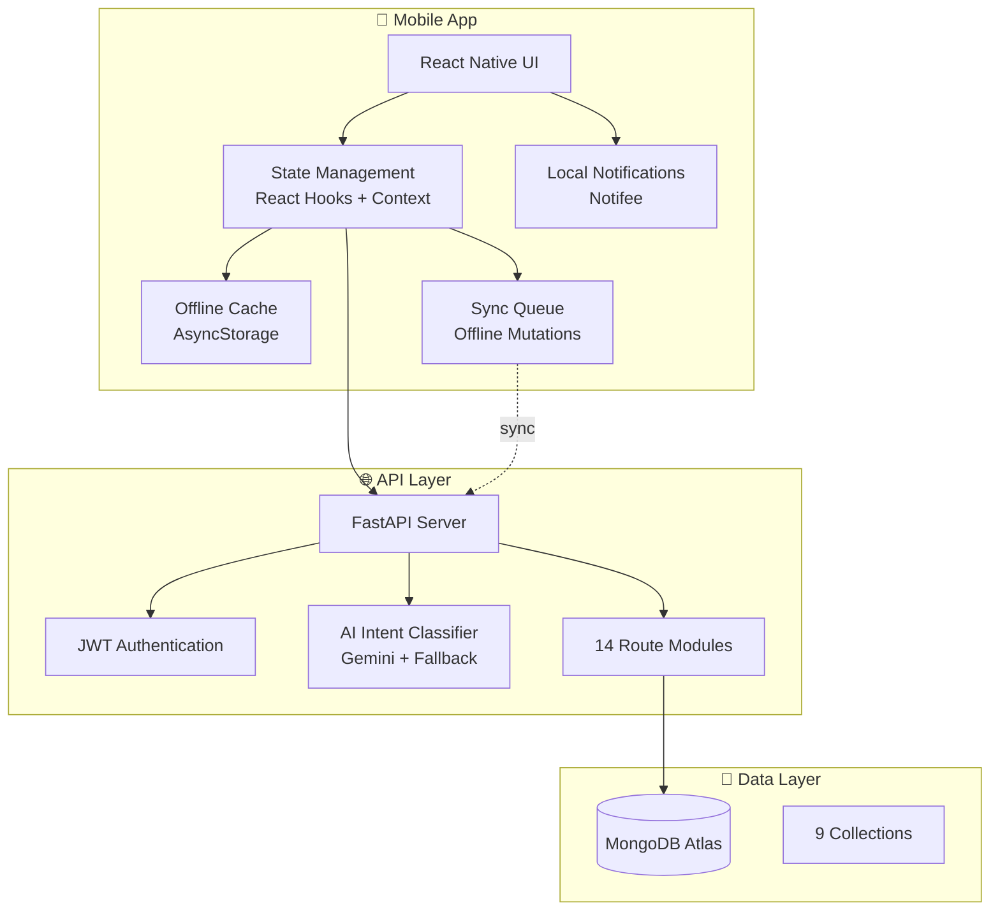
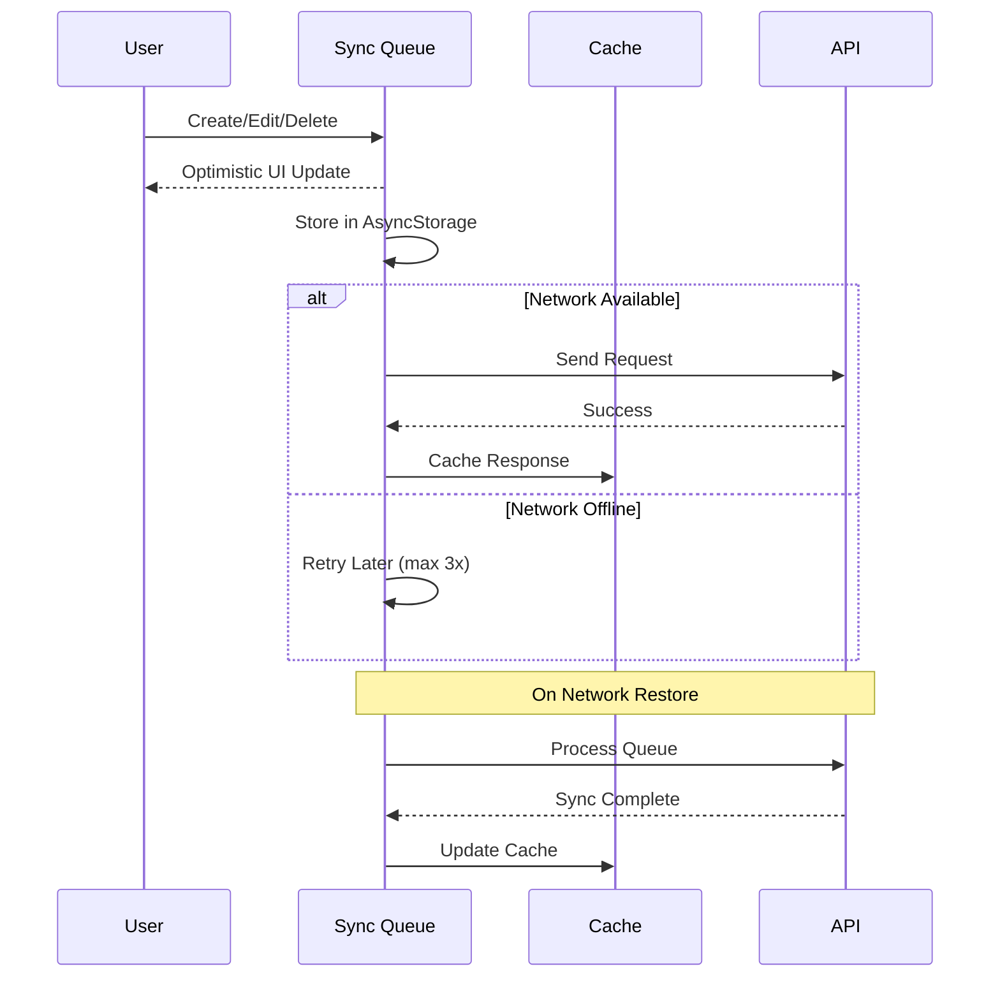

<div align="center">

# 📚 SmartNotify

### AI-Powered Student Productivity Suite

**Your intelligent class scheduling, attendance tracking, and academic planning companion — powered by AI.**

---

[](https://reactnative.dev/)
[](https://fastapi.tiangolo.com/)
[](https://www.mongodb.com/)
[](https://www.typescriptlang.org/)
[](https://www.python.org/)
[](LICENSE)
[](CONTRIBUTING.md)
[](https://github.com/yourusername/smartnotify/releases)

---

**SmartNotify** is a full-stack mobile application that combines AI-powered natural language scheduling with comprehensive student productivity tools. Simply type *"Add Math class tomorrow at 10am"* and the AI handles the rest — creating events, scheduling reminders, and organizing your entire academic life.

<br/>

### 🎥 Demo

> *Coming soon — GIF walkthrough of AI scheduling, notifications, and dashboard*

</div>

---

## ✨ Features

<table>
<tr>
<td width="50%">

### 🤖 AI-Powered Scheduling
- Natural language event creation
- Smart intent detection (12+ intents)
- Auto-update, delete, and query events
- Study recommendations based on schedule

### 📅 Smart Calendar
- Monthly grid with color-coded dots
- Classes, assignments, exams, holidays on one view
- Free period detection

### 📊 Attendance Tracking
- Per-subject attendance stats
- Color-coded progress (green >75%, orange 70-75%, red <70%)
- "Classes you can still skip" calculator
- Mark attended/missed from notifications

### 📝 Notes & Planning
- Text, image, PDF, and voice note types
- Subject-based organization
- Full-text search
- Offline caching

</td>
<td width="50%">

### 📋 Task Management
- Priority levels (high/medium/low)
- Categories and due dates
- Streak tracking
- Batch operations

### 🎓 Exam Planner
- Exam types (Internal, Mid, Semester, Practical)
- Countdown timers
- Date-grouped calendar view

### 🏆 Gamification
- XP points and leveling system
- 20 achievements + 10 badge tiers
- Daily, attendance, and task streaks
- Weekly and monthly goals

### 🔔 Smart Notifications
- Snooze (5/10/15 min)
- Mark attendance from notification
- Full-screen reminders for classes
- Background notification handling

</td>
</tr>
</table>

| Feature | Description |
|---------|-------------|
| 🏠 **Smart Dashboard** | Customizable widget-based home screen with reorder support |
| 🔍 **Global Search** | Instant search across all data collections |
| 📦 **Backup & Restore** | Export/import JSON with merge and replace modes |
| 📈 **Statistics** | Charts for attendance, productivity, study hours |
| 🎨 **Themes** | Light, Dark, and AMOLED modes with font scaling |
| 🔌 **Offline-First** | Queue mutations, cache reads, auto-sync on reconnect |
| 🔒 **Security** | Encrypted token storage, input validation, JWT auth |
| ♿ **Accessibility** | Screen reader support, font scaling, high contrast |

---

## 🏗️ Architecture



### 📁 Project Structure

```
smartnotify/
├── 📱 ClassReminder/               # React Native Mobile App
│   ├── app/                         # 27 screen components
│   │   ├── Home.tsx                 # Smart dashboard
│   │   ├── Login.tsx / Register.tsx # Authentication
│   │   ├── Calendar.tsx             # Monthly calendar
│   │   ├── Tasks.tsx                # Daily planner
│   │   ├── Assignments.tsx          # Assignment manager
│   │   ├── Exams.tsx                # Exam planner
│   │   ├── Attendance.tsx           # Attendance tracker
│   │   ├── Timetable.tsx            # Recurring timetable
│   │   ├── Statistics.tsx           # Charts & analytics
│   │   ├── Notes.tsx                # Note manager
│   │   ├── Rewards.tsx              # Gamification
│   │   └── Settings.tsx             # App settings
│   ├── components/                  # 21 reusable components
│   │   ├── charts/                  # Bar, Line, Circular charts
│   │   └── widgets/                 # 12 dashboard widgets
│   ├── hooks/                       # 15 custom hooks
│   ├── services/                    # 15 service modules
│   ├── constants/                   # Theme, settings, app config
│   └── utils/                       # Date utilities
│
├── 🔧 backend/                      # FastAPI Python Backend
│   ├── routes/                      # 14 API route modules
│   ├── models/                      # 9 Pydantic models
│   ├── services/                    # AI service (Gemini)
│   └── utils/                       # Auth, validation, security
│
└── 📂 config files
    ├── android/                     # Android native config
    ├── package.json                 # Frontend dependencies
    └── requirements.txt             # Backend dependencies
```

---

## 🛠️ Tech Stack

### Frontend
| Technology | Purpose |
|-----------|---------|
| **React Native 0.86** | Cross-platform mobile framework |
| **TypeScript 5.8** | Type-safe development |
| **React Navigation 7** | Screen navigation |
| **AsyncStorage** | Local data persistence |
| **Notifee** | Rich local notifications |
| **Axios** | HTTP client |
| **React Native SVG** | Chart rendering |
| **React Native Vector Icons** | 2000+ Material icons |
| **NetInfo** | Network connectivity detection |

### Backend
| Technology | Purpose |
|-----------|---------|
| **FastAPI 0.115** | Async Python web framework |
| **MongoDB 7.x** | NoSQL database |
| **PyMongo 4.13** | MongoDB driver |
| **Pydantic 2.11** | Data validation |
| **Google Gemini AI** | Natural language processing |
| **python-jose** | JWT token management |
| **bcrypt** | Password hashing |
| **Pydantic** | Request/response validation |

### DevOps & Tools
| Technology | Purpose |
|-----------|---------|
| **Hermes** | JavaScript engine (optimized) |
| **ProGuard** | Code minification |
| **Metro** | JavaScript bundler |
| **ESLint** | Code linting |
| **Prettier** | Code formatting |
| **Jest** | Testing framework |

---

## 🚀 Getting Started

### Prerequisites

- **Node.js** ≥ 22.11.0
- **Python** ≥ 3.11
- **Android Studio** (for Android development)
- **MongoDB** (local or Atlas cloud)

### 1️⃣ Clone the Repository

```bash
git clone https://github.com/yourusername/smartnotify.git
cd smartnotify
```

### 2️⃣ Backend Setup

```bash
cd backend

# Create virtual environment
python -m venv venv
source venv/bin/activate  # Windows: venv\Scripts\activate

# Install dependencies
pip install -r requirements.txt

# Configure environment
cp .env.example .env
# Edit .env with your MongoDB URI, JWT secret, and Gemini API key

# Start the server
uvicorn main:app --host 0.0.0.0 --port 8000 --reload
```

### 3️⃣ Frontend Setup

```bash
cd ClassReminder

# Install dependencies
npm install

# Start Metro bundler
npm start

# Run on Android (in a new terminal)
npm run android
```

### 4️⃣ Environment Variables

Create `backend/.env`:

```env
MONGO_URI=mongodb+srv://your-connection-string
DATABASE_NAME=classreminder
JWT_SECRET_KEY=your-super-secret-key
GEMINI_API_KEY=your-google-gemini-api-key
```

---

## 📸 Screenshots

<div align="center">

| Dashboard | AI Chat | Calendar | Rewards |
|:---------:|:-------:|:--------:|:-------:|
|  |  |  |  |

| Dark Theme | Statistics | Tasks | Notes |
|:----------:|:----------:|:-----:|:-----:|
|  |  |  |  |

</div>

> 📌 **Note:** Replace placeholder images with actual screenshots before publishing.

---

## 📊 API Endpoints

| Module | Endpoint | Method | Description |
|--------|----------|--------|-------------|
| **Auth** | `/auth/register` | POST | Create account |
| | `/auth/login` | POST | Authenticate user |
| **Events** | `/events/` | GET/POST | List & create classes |
| | `/events/{id}` | PUT/DELETE | Update & delete |
| | `/events/{id}/attendance` | PUT | Mark attendance |
| | `/events/attendance/summary` | GET | Attendance stats |
| **AI Chat** | `/ai/chat` | POST | Natural language scheduling |
| **Timetable** | `/timetable/` | GET/POST | Weekly timetable CRUD |
| | `/timetable/generate` | POST | Generate class events |
| **Tasks** | `/tasks/` | GET/POST | Daily planner CRUD |
| | `/tasks/{id}/toggle` | PUT | Toggle completion |
| **Assignments** | `/assignments/` | GET/POST | Assignment CRUD |
| | `/assignments/upcoming` | GET | Due within 7 days |
| **Exams** | `/exams/` | GET/POST | Exam CRUD |
| | `/exams/upcoming` | GET | Future exams |
| **Notes** | `/notes/` | GET/POST | Notes with search |
| | `/notes/subjects` | GET | Subject list |
| **Calendar** | `/calendar/` | GET/POST | Holidays & events |
| **Stats** | `/stats/dashboard` | GET | Aggregated analytics |
| **Dashboard** | `/dashboard/` | GET | Smart dashboard data |
| **Search** | `/search/?q=` | GET | Global search |
| **Backup** | `/backup/export` | GET | Export JSON |
| | `/backup/import` | POST | Import JSON |
| **Rewards** | `/rewards/` | GET | XP, streaks, achievements |
| | `/rewards/add-xp` | POST | Award XP |

---

## 🔐 Security Features

- ✅ **JWT Authentication** — Secure token-based session management
- ✅ **Encrypted Local Storage** — Token and user data encrypted on device
- ✅ **Password Hashing** — bcrypt with salt rounds
- ✅ **Token Expiry Detection** — Auto-logout on expired tokens
- ✅ **Input Validation** — Pydantic models + custom validators
- ✅ **401 Auto-Logout** — Axios interceptor handles unauthorized responses
- ✅ **Owner-based Data Isolation** — All queries filtered by owner_id
- ✅ **Offline Queue Encryption** — Sensitive data encrypted at rest
- ✅ **CORS Configuration** — Environment-specific origin control

---

## 🧩 Offline Architecture



---

## 🗄️ Database Schema

| Collection | Purpose | Key Fields |
|-----------|---------|------------|
| `users` | User accounts | name, email, password (hashed) |
| `events` | Class schedules | title, date, time, attended, location |
| `timetable` | Weekly templates | day_of_week, time, subject |
| `tasks` | Daily planner | priority, due_date, category, completed |
| `assignments` | Homework tracker | subject, due_date, priority, attachment |
| `exams` | Exam planner | exam_type, date, duration, location |
| `notes` | Note manager | content, subject, note_type, pinned |
| `calendar_events` | Holidays/personal | date, category, notes |
| `rewards` | Gamification | xp, level, streaks, achievements, badges |

---

## 🗺️ Roadmap

### ✅ Completed
- [x] AI-powered scheduling with natural language
- [x] Smart notifications with snooze and attendance
- [x] Full attendance tracking system
- [x] Task, assignment, and exam management
- [x] Weekly timetable with auto-generation
- [x] Monthly calendar with color-coded events
- [x] Notes with offline caching
- [x] Backup & restore (JSON export/import)
- [x] Statistics dashboard with charts
- [x] Gamification (XP, levels, achievements, badges)
- [x] Global search across all data
- [x] Offline-first architecture with sync queue
- [x] Material 3 design with Dark/AMOLED themes
- [x] Onboarding flow
- [x] Accessibility support

### 🔮 Planned
- [ ] Google Drive cloud sync
- [ ] Biometric authentication
- [ ] Push notifications via FCM
- [ ] Widget support (Android home screen)
- [ ] Apple Watch / Wear OS companion
- [ ] Study session timer (Pomodoro)
- [ ] GPA calculator
- [ ] Course catalog integration
- [ ] Multi-language support (i18n)
- [ ] Collaborative study groups
- [ ] Integration with Google Calendar
- [ ] Export to PDF/iCal

---

## 🤝 Contributing

Contributions are welcome! Please follow these steps:

1. **Fork** the repository
2. **Create** a feature branch (`git checkout -b feature/amazing-feature`)
3. **Commit** your changes (`git commit -m 'Add amazing feature'`)
4. **Push** to the branch (`git push origin feature/amazing-feature`)
5. **Open** a Pull Request

### Development Guidelines

- Follow the existing code style (TypeScript for frontend, Python for backend)
- Add tests for new features
- Update documentation as needed
- Use descriptive commit messages
- Keep PRs focused on single changes

---

## 📜 License

This project is licensed under the **MIT License** — see the [LICENSE](LICENSE) file for details.

---

## 👨‍💻 Developer

Built with ❤️ by **SmartNotify**

- 📧 Email: [support@classreminder.app](mailto:support@classreminder.app)
- 🌐 Website: [classreminder.app](https://classreminder.app)

---

<div align="center">

### ⭐ Star this repo if you find it useful!

**Made with React Native • FastAPI • MongoDB • Gemini AI**

<br/>

[](https://reactnative.dev/)
[](https://ai.google.dev/)

</div>
